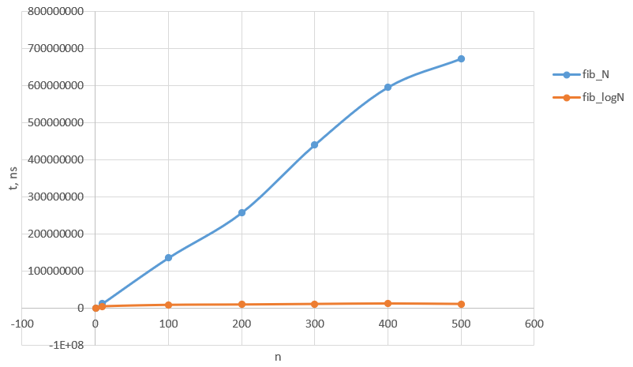

### 1. argparse
argparse, который использовался для парсинга аргументов командной строки, не предоставляет возможности реализовать в точности требуемый интерфейс программы, в котором либо вызывается программа с двумя аргументами (`fib.py -n 10 -a N`), либо с одним (`fib.py --test`). Для подобного поведения потребуется реализовывать т.н. [sub-commands](https://docs.python.org/dev/library/argparse.html#sub-commands), но в таком случае вызовы будут также требовать названия sub-command, т.е. `fib.py run -n 10 -a N` или `fib.py test --test` для sub-command `run` и `test` соответственно, что не соответствует требованию задания. В связи с этим реализована "ручная" проверка и вручную переписана строка `usage`. 
```python
if args.test and (args.n or args.a):
    parser.error("can't run with both --test and -n or -a")
```
```python
parser = ArgumentParser(usage="fib.py [-h] -n N -a A | --test")
```

### 2. Время затраченное на расчёт
К сожалению, измеренное время работы функций сильно варьировалось от запуска к запуску, что приводило к тому, что время выполнения функции `fib_LogN` могло превышать `fib_N` даже для достаточно больших `n`. В связи с этим для проверки корректности работы алгоритмов в циклы была внесена задержка 1ms (`sleep(10**-3)`), чтобы указанные флуктуации не были заметны. **В итоговом коде эти строки закомментированны**.

В результате проверки были построены следующие зависимости времени работы функций `fib_LogN` и `fib_N` от `n`: 



Отмечу также, что, для того, чтобы не дублировать код, валидирующий входные параеметры, вынес функции `fib_logN` и `fib_N` в `fibonacci`, где написал его единожды. Для удобства вычислял время работы именно функции `fibonacci`, посчитав, что временем на проверки параметров можно пренебречь (особенно с учетом указанных выше флуктуаций). 
